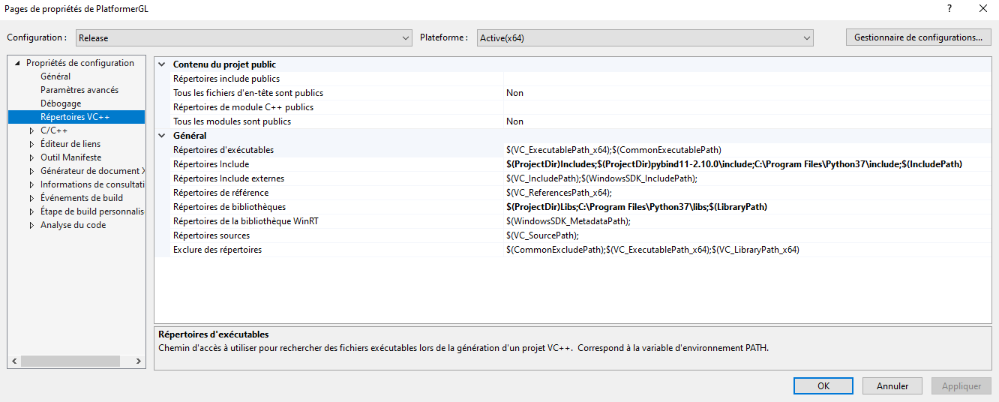
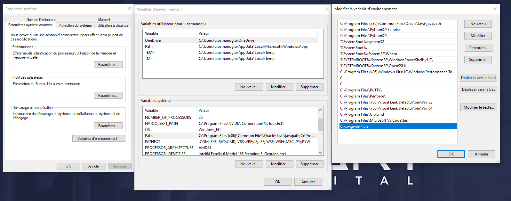
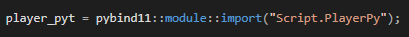
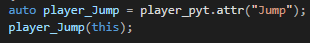
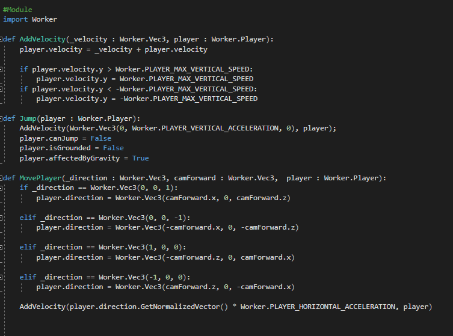
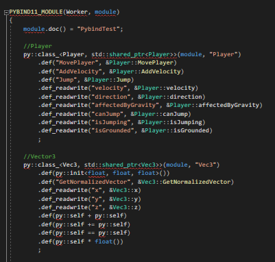
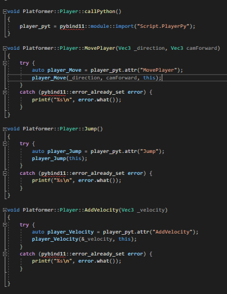

# Python Binding

This project’s goal is to use Python in our C++ engine. To achieve that, we have 2 choices of tools : `Pybind11` and `Swig`. 

According to the pybind11 github’s readme, Pybind11 is a "lightweight header-only library that exposes C++ types in Python and vice versa, mainly to create Python bindings of existing C++ code". Basically, it is a library that allows you to use python in c++ and c++ in python.

According to the official swig website, Swig or Simplified Wrapper and Interface Generator is "an interface compiler that connects programs written in C and C++ with scripting languages".
It is also a library that allows you to use python in c++ and vice versa but it also works with some others langages as Perl or Ruby.

---
## How to install :

### Pybind11 :

- Get the library on the **creator’s github** : https://github.com/pybind/pybind11
- Put it in your project 
>It can be out of it but if you do so, you will have to download it again if you want to launch your project on another computer
- In **Visual Studio**, *right-click* on the solution then go in the **properties**
- Then go to **VC++ repertories → Include repertories**
- Add it the **path** to your **pybind11 library**

### Swig : 

- Go on this address https://www.swig.org/download.html
- Click on **All Releases** and download the latest version
- You’ll get a .zip, unzip it and then move it on your **C : drive**
- Then add its path to your **environnement variables**
- To do so, search My pc on the windows search bar and go on the **properties**
- Then **Advanced system settings → Environnement variables**
- Then in the system variables parts, *double click* on path
- click on the **New** button and add the path
>You can check if it works by taping in cmd this command : swig -version

---
## How to use them :

### Pybind11 : 

    To use c++ in python, create a c++ file where you include the pybind library. In that file, create a module and add in it all the functions, variables, classes ect you want. Be carefull : when you add a class, you have to define all the variables and functions that are inside and that you will be able to use in python.
    Once it’s done, you just have to import the module in your python file and you can use its components.
    To use python in c++, include the pybind library in your c++ file and import your python script with this command  auto example = pybind11::module::import("Example"); After that, the variable example contains every components of the Example script, you just has to call them like that : 
    auto example_Jump = example.attr("Jump"); example_jump is now the attibute Jump of Example, you can use it as it. 

	
### Swig :

    To use c++ in python, as for Pybind, you have to create a module. But this time, you have to create a .i file in which you will define your module and its components. With Swig, you don’t have to define every functions and variables inside a structure or class you want to add in your module.
    You have to include in your module the .h file in which is define the components you want in your module.
    Then in your consol, use this commands : swig -c++ -python example.i
    This will create 2 files : a .c or .cxx and a .py. The file you have to import to use your module is the .py file.

---
## Advantages/disadvantages :
	
### Pybind :

Advantages :

- Really easy to install, you just have to install it once on your project
- Modules creations controlled entirelly : you choose exactly what is inside your module

Disadvantages :

- Modules creation can be long and boring : You have to define every single components of your modules and every components of the components if they have some.
- Works only with python
- everything is handmade, and is no automated

### Swig :

Advantages :

- Can connect with many other languages
- Modules creation really easy and fast
- Modules with swig are more automated
- SWIG is extremely permissive in what it lets you get away with

Disadvantages :

- Installation on the pc, if you don’t works alone or on many pc, you have to install it on every monitors.
- Modules wrapping creates lots of files with differents names : .i, .cxx, .py . It can be confusing for beginners
- Several very specific errors that are difficult to fix

---
## Why did we choose Pybind11 ?

	We choose Pybind11 rather than Swig because we prefer having a total control and knowledge of what we put in our modules. The installation more efficient in a project with many programmers was also a good argument in favor of Pybind11.
---
## What did we do with it ?

    We managed the control of our player in python. In PythonBinder.cpp we made the module Worker. 

    We made the classes to call them in the PlayerPy.py file. 

    We have the functions Addvelocity, Jump, Moveplayer that we call in the functions that are in Player.cpp    

## Credit

    This project was made by Umut Osmanoglu and Antoine William Mordant.
    
